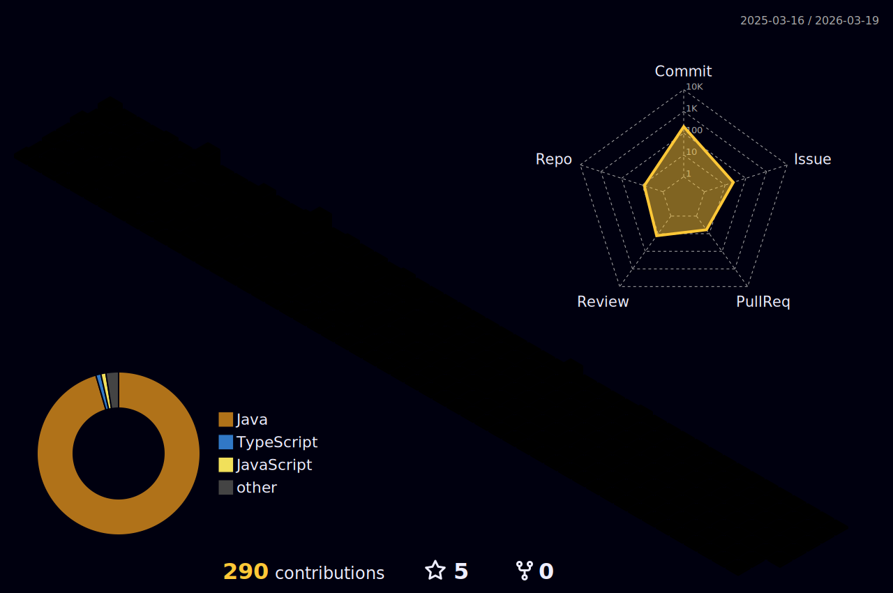

<!-- 헤더 -->

 <!-- 방문자수 표시 -->

  <!-- 내용 -->
# 💪 learned skills

# 🏃‍♂️ learning skills

</a>

<!--/내용 끝-->

 
 

## [Today I Learned](https://github.com/kkssbbb/TIL)
  
   
   
  
  <!-- 깃허브 상태표시 -->

  
  <!-- 백준 티어 표시-->

<!-- 3d 잔디 -->

  
  

