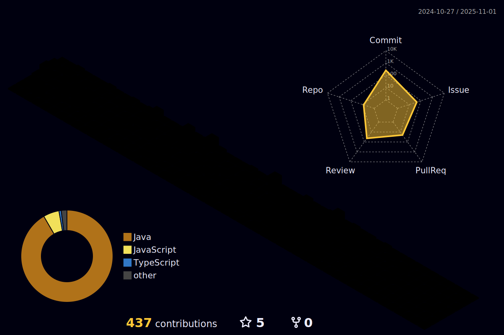

<!-- 헤더 -->

<!-- 내용 -->

<!-- test test test -->
<!--

  
  
  

</a>

 -->
  

<!--/내용 끝-->

 
 

### [📝 Today I Learned](https://github.com/kkssbbb/TIL)

 

### [⌨️ Blog](https://kingbini.tistory.com/)

  
   
   
  
  <!-- 깃허브 상태표시  -->
<!---->

<!-- 3d 잔디 -->
<!--  -->

  
  

